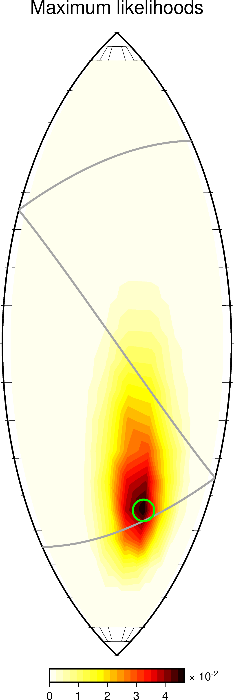

Plotting moment tensor results
------------------------------

Suppose we are running a moment tensor grid search:

.. code::

    ds = grid_search(data, greens, misfit, stations, origins, sources)

After the above command finishes, the data structure `ds` will hold all the moment tensors and corresponding misfit values.  

For a grid of regulary-spaced moment tensors, `ds` may look something like:

.. code::

    >>> print(ds)

    Summary:
      grid shape: (10, 10, 20, 10, 10, 10, 1)
      grid size:  2000000
      mean: 2.548e-09
      std:  2.851e-10
      min:  1.328e-09
      max:  3.640e-09

    Coordinates:
      * rho         (rho) float64 5.018e+15 5.418e+15 ... 9.272e+15 1.001e+16
      * v           (v) float64 -0.3313 -0.2995 -0.2371 ... 0.2371 0.2995 0.3313
      * w           (w) float64 -1.178 -1.176 -1.167 -1.141 ... 1.167 1.176 1.178
      * kappa       (kappa) float64 18.0 54.0 90.0 126.0 ... 234.0 270.0 306.0 342.0
      * sigma       (sigma) float64 -81.0 -63.0 -45.0 -27.0 ... 27.0 45.0 63.0 81.0
      * h           (h) float64 0.05 0.15 0.25 0.35 0.45 0.55 0.65 0.75 0.85 0.95
      * origin_idx  (origin_idx) int64 0

Misfit values
"""""""""""""

To plot the misfit values returned by the grid search, we can pass `ds` to a plotting utility as follows:

.. code::

    from mtuq.graphics import plot_misfit_lune
    plot_misfit_lune(filename, ds)

.. image:: images/20090407201255351_misfit_lune.png
  :width: 100 

Maximum likelihoods
"""""""""""""""""""

If a data variance estimate `var` is available, then misfit values can be converted to likelihood values.  
In the following approach, a two-dimensional maximum likelihood surface is obtained by maximimizing over orientiation and magnitude parameters:

.. code::

    from mtuq.graphics import plot_likelihood_lune
    plot_likelihood_lune(filename, ds, var)

Marginal likelihoods
""""""""""""""""""""

An alternative for visualizing likelihood is integrate over orientiation and magnitude parameters, giving a two-dimensional marginal distribution.  In this case, it is natural to use the so-called v,w parameterization, as follows:

.. code::

    from mtuq.graphics import plot_marginal_vw
    plot_marginal_vw(filename, ds, var)

.. image:: images/20090407201255351_marginal_vw.png
  :width: 100 

Tradeoffs between source type and orientation
"""""""""""""""""""""""""""""""""""""""""""""

To see how the orientation of the best-fitting moment tensor varies with respect to source type, we can add the `show_tradeoffs=True` option to any of the plotting utilities as follows:

.. code::

    from mtuq.graphics import plot_misfit_lune
    plot_misfit_lune(filename, ds, show_tradeoffs=True)

.. image:: images/20090407201255351_mt_tradeoffs.png
  :width: 100 

Tradeoffs between source type and magnitude
"""""""""""""""""""""""""""""""""""""""""""

To see how the magnitude of the best-fitting moment tensor varies with respect to source type, we can use the following:

.. code::

    from mtuq.graphics import plot_magnitude_tradeoffs_lune
    plot_magnitude_tradeoffs_lune(filename, ds)

.. image:: images/20090407201255351_Mw_tradeoffs.png
  :width: 100 

Source code
"""""""""""

[`script to reproduce above figures <https://github.com/uafgeotools/mtuq/blob/master/docs/user_guide/05/code/gallery_mt.py>`_]

Users can run the script immediately after `installing MTUQ <https://uafgeotools.github.io/mtuq/install/index.html>`_, without any additional setup.

