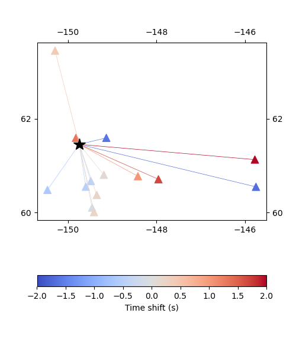
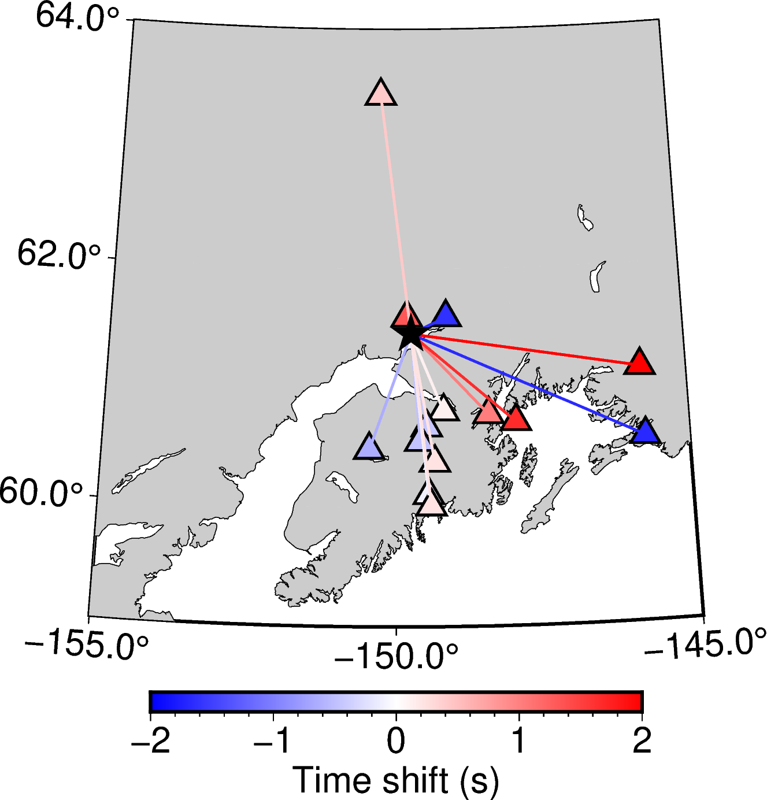

Customizing figures
===================

MTUQ plotting functions aim for generality and ease of use. Sometimes, this results in a default figure that is a bit generic. 

Fortunately, figure appearance is highly customizable, as illustrated below.

Time shift and amplitude ratio figures
---------------------------------------

To plot how time shifts, amplitude ratios, or other `trace attributes <https://uafgeotools.github.io/mtuq/user_guide/06/trace_attributes.html>`_ vary geographically, we can pass the output of `collect_attributes <https://uafgeotools.github.io/mtuq/library/generated/mtuq.Misfit.collect_attributes.html#mtuq.Misfit.collect_attributes>`_ to a plotting function as follows:

.. code::

    plot_time_shifts(dirname, attrs, stations, origins)

Because we haven't specified a map projection or other details, it's no surprise that the resulting figure is quite generic:

To some extent, the above figure can be customized through optional input arguments to the default backend function. For argument descriptions, follow the links in the `plot_time_shifts <https://uafgeotools.github.io/mtuq/library/generated/mtuq.graphics.plot_time_shifts.html>`_ documentation, or see the `default backend <https://uafgeotools.github.io/mtuq/library/generated/mtuq.graphics.attrs._default_backend.html>`_ documentation directly.

In comparison, a much more powerful approach is to overload the backend function completely:

.. code::

    plot_time_shifts(dirname, attrs, stations, origins, backend=custom_backend)

To illustrate, we have implemented a `custom backend <https://uafgeotools.github.io/mtuq/user_guide/06/custom_backends.html#example>`_ relevant to `Silwal2016 <https://uafgeotools.github.io/mtuq/references.html>`_. The result of calling `plot_time_shifts` with this new backend is:

.. note::

    Note that frontend functions perform only data manipulation. All calls to graphics libraries (matplotlib, GMT, PyGMT and so on) occur in the backends. As a result, figures are customizable to extent that users are free to use any graphics library.

.. warning::

    matplotlib was used to create the default figure above, while PyGMT was used to generate the custom figure.  PyGMT requires `additional installation steps <https://uafgeotools.github.io/mtuq/install/index.html#graphics-dependencies>`_, beyond `pip install -e mtuq/`.

Misfit and likelihood figures
-----------------------------

`Misfit and likelihood figures <https://uafgeotools.github.io/mtuq/library/index.html#moment-tensor-and-force-visualization>`_ for force, moment tensor, depth and hypocenter can also be customized by user-supplied backends.

