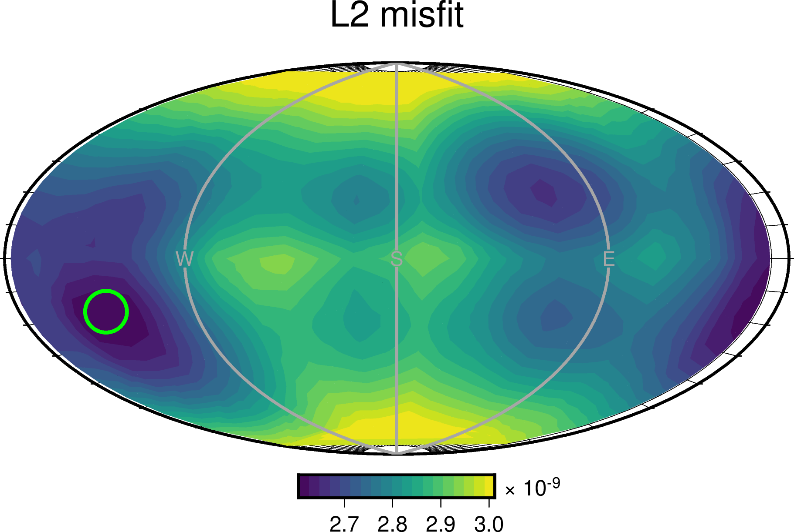
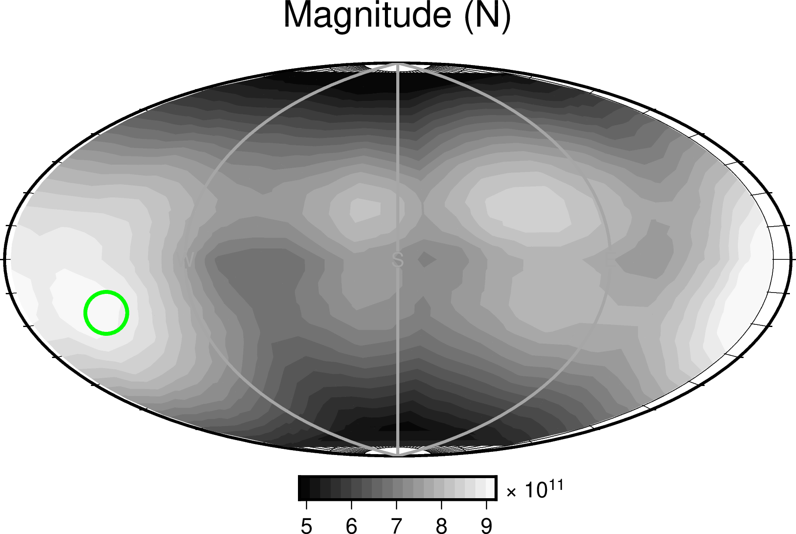

Plotting force results
----------------------

Suppose we are running a force search:

.. code::

    ds = grid_search(data, greens, stations, origins, sources)

After the grid search finishes, the data structure `ds` will contain all the forces and corresponding misfit values.

For a grid of regulary-spaced forces, `ds` may look something like:

.. code::

    >>> print(ds)

    Summary:
      grid shape: (200, 25, 25, 1)
      grid size:  125000
      mean: 2.984e-09
      std:  1.428e-10
      min:  2.605e-09
      max:  3.339e-09

    Coordinates:
      * F0          (F0) float64 1e+11 1.012e+11 1.023e+11 ... 9.772e+11 9.886e+11
      * phi         (phi) float64 7.2 21.6 36.0 50.4 ... 309.6 324.0 338.4 352.8
      * h           (h) float64 -0.96 -0.88 -0.8 -0.72 -0.64 ... 0.72 0.8 0.88 0.96
      * origin_idx  (origin_idx) int64 0

Misfit values
"""""""""""""

To plot the misfit values returned by the grid search, simply pass `ds` to a plotting utility as follows:

.. code::

    from mtuq.graphics import plot_misfit_force
    plot_misfit_force(filename, ds)

Maximum likelihoods
"""""""""""""""""""

If a data variance estimate `var` is available, then misfit values can be converted to likelihood values.  
In the following approach, a two-dimensional likelihood surface is obtained by maximimizing magnitude:

.. code::

    from mtuq.graphics import plot_likelihood_force
    plot_likelihood_force(filename, ds, var)

.. image:: images/20090407201255351_likelihood_force.png
  :width: 200 

Tradeoffs between force orientation and magnitude
"""""""""""""""""""""""""""""""""""""""""""""""""

To see how the magnitude of the best-fitting force varies with respect to orientation, we can use the following:

.. code::

    from mtuq.graphics import plot_force_tradeoffs
    plot_force_tradeoffs(filename, ds)

Source code
"""""""""""

[`script to reproduce above figures <https://github.com/uafgeotools/mtuq/blob/master/docs/user_guide/code/gallery_force.py>`_]

Users can run the script immediately after `installing MTUQ <https://uafgeotools.github.io/mtuq/install/index.html>`_, without any additional setup.

